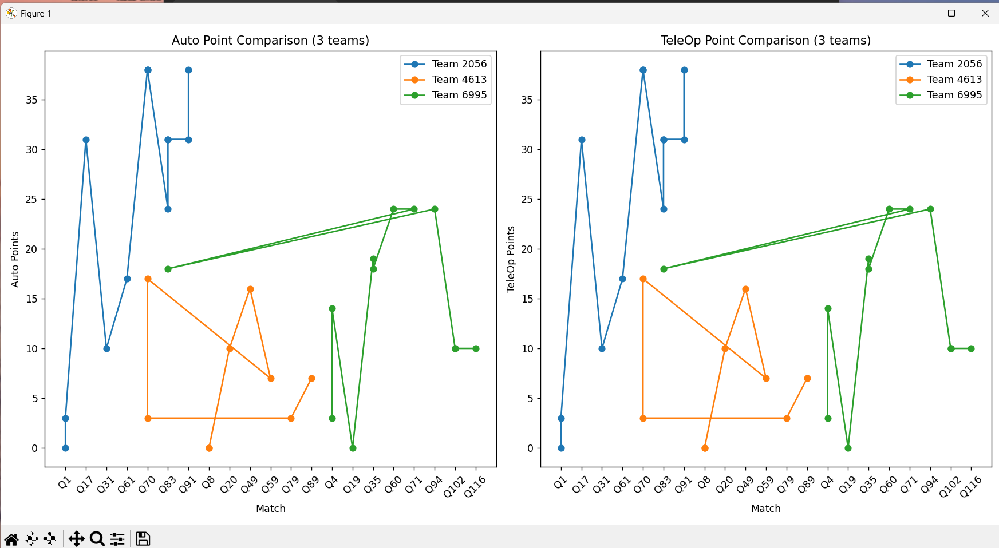

# Vigil

Vigil is a FRC robotics health monitor, anomaly detector, and predictive maintenance dashboard that monitors robotics teams' performance data over time - including reliability metrics, and detects when a team may be at risk of under/overperforming and what their current performance may be indicating.

The end date for this project is TBD, but I am aiming for a fully working proto-version by June 13th. The goal is for it in the end to be workable at a competition like Fairbotics and then try to train a model using data from that competition, as well as competitions in the offseason like Chezy Champs, Sunset Showdown, and from the Einstein Field back in April. 

Then there will be something better by Battle at the Border or Beach Blitz in October and November, where it will be trained to try to have working full time in the 2026 season.

Updated 6/11/2025: Apparently Statbotics and API and the FMS do not record team specific data except for the endgame. issues 😭

Updated 6/12/2025: The new plan is to use Pandas to directly pull off the Raw Lovat data and to force its input
Updated 6/12/2025 2 hours later: Very happy we got a basic prototype of anomaly working. Should be MUCH easier to continue

Updated 6/16/2025 Performance Graphing. Viewing health trends works. Can compare teams now:

def upload_menu():
    while True:
        print("\nChoose a file to upload:")
        print("1: Overall Team Insights (all teams)")
        print("2: All Teams EPA Breakdown")
        print("3: Event Team Insights")
        print("4: Event EPA Breakdown")
        print("5: Event Alliance Insights")
        print("6: Event Strength of Schedule")
        print("7: Event Simulation")
        print("8: Go Back to Main Menu")

        choice = input("Your choice: ")

        if choice == '1':
            upload_file("Overall Insights", "2025_insights.csv")
        elif choice == '2':
            upload_file("All Teams EPA Breakdown", "2025_epa_breakdown.csv")
        elif choice == '3':
            upload_file("Event Team Insights", "2025isde1_team_insights.csv")
        elif choice == '4':
            upload_file("Event EPA Breakdown", "2025isde1_epa_breakdown.csv")
        elif choice == '5':
            upload_file("Event Alliance Insights", "2025isde1_alliance_insights.csv")
        elif choice == '6':
            upload_file("Event Strength of Schedule", "2025isde1_sos.csv")
        elif choice == '7':
            upload_file("Event Simulation", "2025isde1_simulation.csv")
        elif choice == '8':
            break
        else:
            print("Invalid selection. Please try again.")
